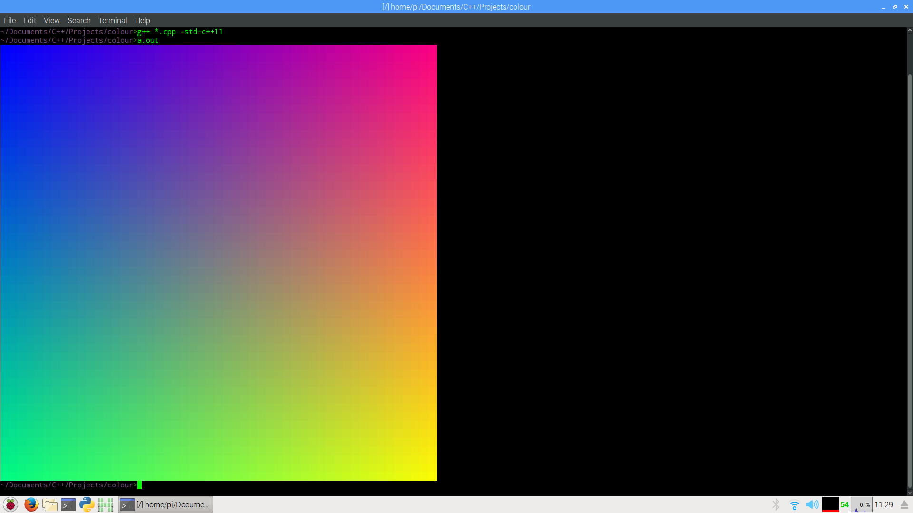

## Colour!
This is just a small C++ thingy to try and print stuff in colour to a terminal.  

Note that this does require a terminal (emulator) that supports 24-bits colour.
(I'm using gnome-terminal, but there are tons of others out there)

###### Credits:
PerlinNoise.hpp: [github.com/Reputeless/PelinNoise](https://github.com/Reputeless/PerlinNoise)

###### Building:
``g++ -std=c++11 -o ./a.out Colour.cpp main.cpp``

###### Running: 
``./a.out``

###### Example:

